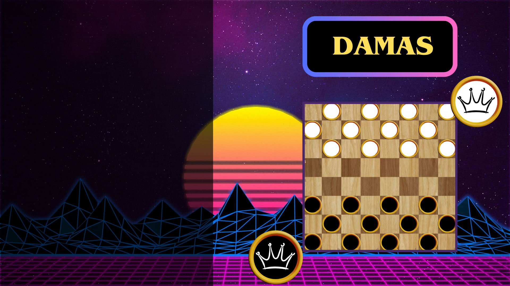

# 📌 MINIMAX DAMAS INGLESAS



## 📖 Descripción
Breve descripción del proyecto. Explica su propósito y qué problemas resuelve.

## 🚀 Características
- ✅ Característica 1
- ✅ Característica 2
- ✅ Característica 3

## 🎥 Demostración


## 📦 Instalación
```bash
# Clonar el repositorio
git clone https://github.com/usuario/repositorio.git

# Entrar al directorio
cd repositorio

# Instalar dependencias
npm install  # o pip install -r requirements.txt para Python
