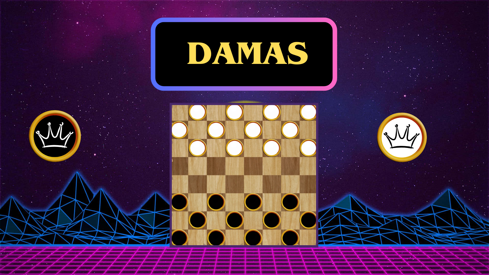
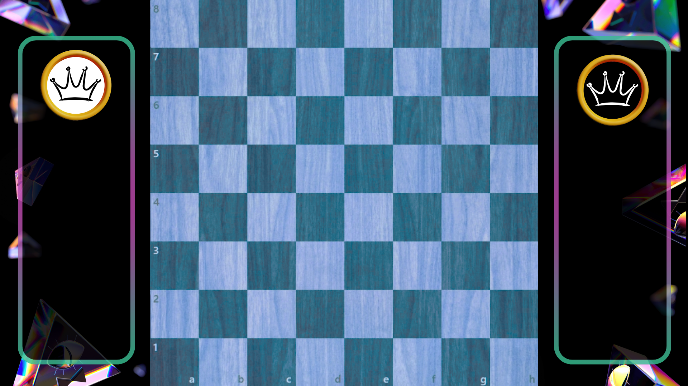

# 📌 MINIMAX DAMAS INGLESAS



## 📖 Descripción
Las damas son un juego de mesa estratégico, las fichas pueden solo moverse por las diagonales hacia el lado del oponente y para ganar, el tablero es de 8x8 y cada jugador tiene en un principio 12 fichas con turnos alternativos para jugar, es necesario capturar todas las fichas de sus oponentes o tener mas fichas en posesión a la vez que se bloquea el movimiento de las fichas del oponente, la captura de una fichas es posible si y sólo si, hay un espacio en la diagonal en la diagonal anterior de la ficha a capturar (figura 1), esta capacidad de captura puede ser a su vez múltiple tal que es posible realizar múltiples capturas con una sola ficha ,con estos movimientos se puede también llegar hacia el lado del oponente, tras esta acción la ficha se convierte en una Dama, con la posibilidad de movilizarse tanto en diagonales hacia al frente como hacia atrás.


## 🚀 Características
- ✅ Código minimax para profundidad variable
- ✅ Código paralelizado con OpenMP
- ✅ Código de forma gráfica con SFML 

## 🎥 Demostración


## 📦 Instalación
```bash
# Clonar el repositorio
git clone https://github.com/usuario/repositorio.git

# Entrar al directorio
cd repositorio

# Instalar dependencias
npm install  # o pip install -r requirements.txt para Python
